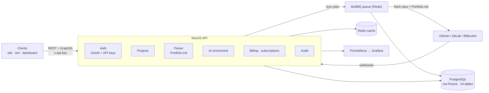

# Gitsink API

**Turn your Git repositories into a portfolio API.** Gitsink syncs repos from GitHub, GitLab and Bitbucket, enriches them with a `Portfolio.md` file you commit next to your code, and serves the result over REST and GraphQL — so a personal site, a bot or a dashboard can render your projects without scraping anything.


## Why this exists

Every developer portfolio ends up hand-maintaining the same project list: a title, a blurb, a stack, a screenshot — all of it already in the repo, all of it going stale the moment you push. Gitsink treats the repo as the source of truth. You commit a `Portfolio.md`, Gitsink parses it, merges it with platform metadata (language, stars, topics, activity), keeps it in sync through webhooks, and exposes it behind an API key. The portfolio updates itself.

## What it does

- **Multi-platform sync.** OAuth for GitHub, GitLab and Bitbucket; webhooks per platform keep projects fresh, with background sync through BullMQ.
- **`Portfolio.md` enrichment.** A front-matter parser with error recovery and versioned metadata, so you can diff and roll back what a repo published (`/metadata/{projectId}/history`, `/compare/{v1}/{v2}`).
- **REST + GraphQL.** 135 documented REST endpoints and a GraphQL schema over the same data.
- **API keys and quotas.** Per-key auth, subscription tiers and billing hooks.
- **Public profiles.** Featured profiles and public project pages built from synced data.
- **Audit and compliance.** Audit logs, activity and compliance reports, exportable.
- **Operations built in.** Health checks (`/health`, `/health/detailed`, `/health/database`), Prometheus metrics at `/metrics`, structured logging, rate limiting and a sandbox mode for trying the API safely.

## Architecture



## Getting started

**Requirements:** Node 20+, PostgreSQL 15, Redis 7.

```bash
npm ci
cp .env.example .env          # then edit: DATABASE_URL, REDIS_URL, JWT_SECRET, TOKEN_ENCRYPTION_KEY
npx prisma migrate deploy     # creates all 24 tables
npx prisma generate
npm run build && npm start    # or: npm run start:dev
```

- Health: <http://localhost:3000/health>
- Swagger UI: <http://localhost:3000/api-docs> (OpenAPI JSON at `/api-docs-json`)
- GraphQL: <http://localhost:3000/graphql>
- Metrics: <http://localhost:3000/metrics>

> **Existing databases:** migrations were previously untracked, so a database built before this change needs baselining once: `npx prisma migrate resolve --applied 0_init`.

### Docker

```bash
docker compose up -d          # API, Postgres, Redis, Caddy, Prometheus, Grafana
```

Compose files per environment: `docker-compose.yaml` (base), `.dev`, `.staging`, `.prod`.

### Secrets with Phase (optional)

The repo is set up for [Phase](https://phase.dev) if you'd rather not keep a local `.env`:

```bash
brew install phasehq/cli/phase && phase auth
npm run phase:dev             # same as start:dev, with secrets injected
```

A plain `.env` works fine without it.

### Key environment variables

| Variable | Purpose |
|---|---|
| `DATABASE_URL` | PostgreSQL connection string |
| `REDIS_URL` / `REDIS_HOST` / `REDIS_PORT` | Cache + BullMQ queues |
| `JWT_SECRET` | JWT signing (32+ chars) |
| `TOKEN_ENCRYPTION_KEY` | Encrypts stored platform tokens (32+ chars) |
| `LOCAL_API_KEY` | Development API key for local requests |
| `GITHUB_CLIENT_ID` / `GITHUB_CLIENT_SECRET` / `GITHUB_CALLBACK_URL` | GitHub OAuth app |
| `GITLAB_API_URL` / `BITBUCKET_API_URL` | Other platforms |
| `SMTP_*` | Transactional email |

Full list in [`.env.example`](.env.example).

## Usage

```bash
API=http://localhost:3000

# List synced projects (paginated)
curl $API/projects -H "x-api-key: $LOCAL_API_KEY"
```

```json
{
  "data": [],
  "meta": { "page": 1, "limit": 20, "total": 0, "totalPages": 0, "hasNextPage": false, "hasPreviousPage": false }
}
```

```bash
# GraphQL
curl -X POST $API/graphql -H 'Content-Type: application/json' \
  -d '{"query":"{ enhancedProjects { id name description } }"}'
```

Without a key you get a clean `401`:

```json
{ "success": false, "error": { "code": "UNAUTHORIZED", "message": "API key missing", "category": "authentication" } }
```

## Testing

```bash
npm test                 # unit tests (jest)
npm run test:e2e         # end-to-end (needs Postgres + Redis)
npm run test:perf        # k6 / artillery load tests
npm run lint             # eslint
npm run build            # nest build
```

## Project status

- ✅ Builds, boots and serves REST + GraphQL + metrics; all health checks green against Postgres 15 and Redis 7.
- ✅ `prisma migrate deploy` creates the full 24-table schema from the committed baseline (verified with no drift).
- 🟡 **Unit tests: ~803 of 928 passing.** The rest are stale specs (test modules missing providers the services gained, assertions that drifted) rather than product failures.
- 🟡 **Lint passes with ~7,000 warnings**, mostly `no-unsafe-*` in specs. Kept visible rather than switched off.
- 🟡 Specs and scripts carry ~400 pre-existing TypeScript errors. CI type-checks the shipped code (`tsconfig.build.json`, clean).
- ⚠️ CI had **never run**: the workflow file was invalid (the `env` context is not allowed in `services`). It runs now, and the deploy jobs are manual-only until the deployment target is real.
- *Unverified:* Caddy/Prometheus/Grafana compose stacks and the k6/artillery suites were not executed during this pass.

## Tech stack

NestJS · TypeScript · Prisma · PostgreSQL · Redis + BullMQ · GraphQL (Apollo) · Jest · Docker + Caddy · Prometheus + Grafana · Sentry · Phase (secrets) · k6 + Artillery

## Docs

[System documentation](docs/system-documentation.md) · [API reference](docs/api-reference.md) · [Public API](docs/public-api-reference.md) · [Metadata management](docs/metadata-management.md) · [Deployment](docs/deployment-guide.md) · [Railway](docs/RAILWAY_DEPLOYMENT.md) · [Disaster recovery](docs/disaster-recovery-plan.md) · [Redis configuration](docs/redis-configuration.md)

## License

[Business Source License 1.1](LICENSE) — source-available, not OSI open source. Built by [Enoch (Enochthedev)](https://github.com/Enochthedev).
